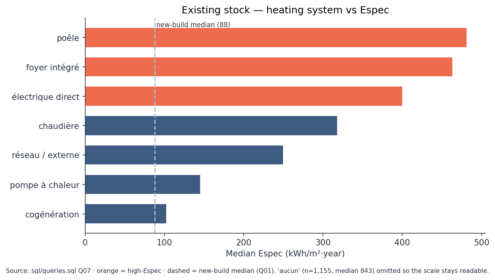

# Walloon building energy performance (PEB) — SQL analysis

| | |
|---|---|
| **Stack** |     |
| **Level** | Intermediate |
| **Data specialty** | BI |

## Objective

Turn Wallonia's open PEB (building energy performance) certificates into a
clean star-schema database, then answer policy-relevant questions with
advanced SQL only — no maps, no dashboard. Typical questions: which
municipalities concentrate energy sieves? does new housing actually
outperform the existing stock, and where is the gap widest?

A short notebook translates three SQL results into recommendations,
illustrated with static matplotlib charts (not an interactive BI layer).

## Data

Two ODWB / SPW Énergie extracts (CC BY, last processed 2026-06-22), joined
on the INS municipality code (`mun_code`):

- [PEB — existing residential](https://www.odwb.be/explore/dataset/peb-certification-residentielle-batiment-existant/) — 874,605 certificates
- [PEB — new residential](https://www.odwb.be/explore/dataset/peb-batiments-residentiels-neufs/) — 110,855 certificates

Both publish **Espec** (kWh/m²·year) and a letter label (++A…G). The
regulatory **Ew** indicator for new buildings is **not** in the open data.
Labels follow the same empirical Espec thresholds; the certification
protocols still differ, so G-share comparisons would be misleading.
Profile: `docs/exploration.md`.

Any numeric comparison of new vs existing stock in this repo is **Espec
only**, with that caveat. Do not read letter-label mixes as one scale.

## Schema

Star schema: two fact tables share the same dimensions.


- `commune` — PK `mun_code` (INS code), not the municipality name.
- `province`, `label_peb` (++A…G plus empirical Espec bands),
  `type_logement` (canonical mapping of English/French source codes).
- Facts `certificats_existant` / `certificats_neuf` at **certificate**
  grain (source IDs can repeat on re-certification).
- View `v_certificats` — `UNION ALL` on Espec, with a `regime` column.
- View `v_priorite_renovation` — one renovation-priority score per municipality:
  60 % sieve floor-area (budget) + 40 % F/G rate (fairness).
- Optional spatial table `limite_communale` — official SPW polygons (Lambert 2008).
  Residential PEB has no building XY (anonymised at municipality). Spatial SQL
  therefore uses area and adjacency (`ST_Touches`), not a map.

**Why two facts rather than one mixed table.** Existing-stock certificates
and new-build declarations follow different protocols. Shared dimensions
make joins legitimate; stuffing both into one table would invite treating
G-share or labels as a single thermometer. Espec is the numeric bridge;
Ew is missing from the open data. Detail: `docs/decisions.md`.

## Result

Eleven commented SQL queries (`sql/queries.sql`, including the priority
view) and a short synthesis
([notebook](notebooks/synthese_resultats.ipynb)). Three takeaways:

1. **New stock is already sober; Hainaut's existing stock is not.** Median
   Espec ~88 kWh/m²·year for new homes vs 339 for existing. The gap is
   widest in Hainaut (+272), narrowest in Walloon Brabant (+200).
2. **Worst rate ≠ largest volume.** Hastière is 65 % F/G but tiny in m².
   Charleroi and Liège hold millions of square metres of sieves at a
   milder rate. A regional budget should follow volume; a fairness call
   can follow rate.
3. **The technical lever is existing-stock heating.** Stoves and direct
   electric sit at 400–480 kWh/m²·year; existing heat pumps (145) already
   look like new builds. Do not steer policy with the share of G in new
   vs existing stock (new has none).




## Reproduce

Download the raw extracts (gitignored under `data/raw/`):

```bash
pip install -e .
python scripts/download_odwb.py
python scripts/etl_odwb.py
python scripts/run_queries.py
python scripts/synthese_figures.py
python scripts/load_spatial.py
python scripts/run_spatial.py
```

Star schema: `sql/schema.sql`. Load rules: `sql/load.sql`. Queries:
`sql/queries.sql`. Charts: `scripts/synthese_figures.py`. Spatial stretch:
`sql/spatial.sql` (DuckDB `spatial`, official commune limits). Output:
`data/processed/peb_wallonie.duckdb` (gitignored, regenerable).

## Repo structure

- `brief/` — portfolio brief and captured objective
- `docs/exploration.md` — column profile and rating-regime notes
- `sql/schema.sql` — star schema (shared dimensions + two fact tables)
- `sql/load.sql` — ETL transforms (types, dates, Espec outliers)
- `sql/queries.sql` — 11 commented business queries (Q11 reads the priority view)
- `sql/spatial.sql` — optional DuckDB spatial queries (density, neighbours)
- `scripts/` — download, profile, ETL, `run_queries.py`, `synthese_figures.py`,
  `load_spatial.py`, `run_spatial.py`
- `notebooks/synthese_resultats.ipynb` — synthesis and recommendations
- `diagrams/modele_relationnel.png` — entity-relationship diagram
- `docs/decisions.md` — why DuckDB, why two fact tables, why Espec as bridge
- `ROADMAP.md` / `JOURNAL.md` — progress (kept in French)

## Presentations

- [Recruiter overview (EN)](docs/slides/presentation-recruteur-en.html)
- [Technical deep dive (EN)](docs/slides/presentation-technique-en.html)
- [Présentation grand public (FR)](docs/slides/presentation-recruteur-fr.html)
- [Présentation technique (FR)](docs/slides/presentation-technique-fr.html)
