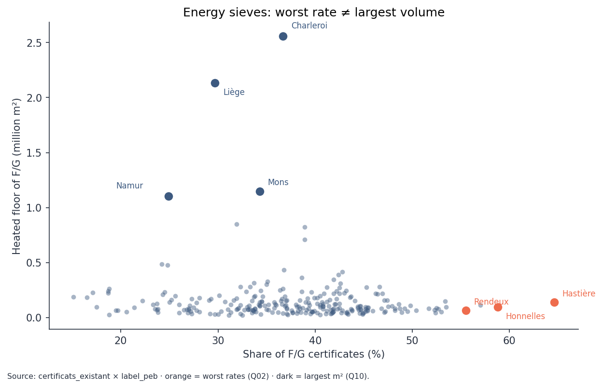

# Energy performance of Walloon buildings

*SQL analysis — synthesis*

---

## The problem

Wallonia publishes energy-performance certificates for homes, but the raw
files do not, by themselves, say where renovation should be concentrated.
An analyst needs fast answers: which municipalities have the most energy
sieves? does new housing actually perform better, and where is the gap
widest?

---

## The data

Two open datasets from the Walloon energy administration: **875,000**
certificates for existing homes and **111,000** for new homes, located at
municipality level — no maps, SQL joins only.

---

## What can be compared

Both files share the same numeric language (annual consumption per square
metre). Almost all new homes already score well: you cannot judge old
energy sieves with the new-build thermometer without saying so.

---

## What the numbers say

A third of existing homes are F or G (median 339 kWh/m²·year) versus
~88 for new builds. The gap is widest in Hainaut.

Square metres to renovate sit in **large cities** (Charleroi, Liège) —
not in the small municipalities with the worst rates.

---

## Recommendations

**Public actor.** Budget for volume (Charleroi, Liège). Treat Hastière
and rural high-rate communes separately, for fairness. The
`v_priorite_renovation` view merges both (60 % volume, 40 % rate).
Priority: Hainaut. Do not steer with the share of G in new vs existing
stock.

**Private actor.** Target existing houses heated with stoves or direct
electric. Heat pumps in the old stock already look like new builds:
that is not where the certificate moves most.
