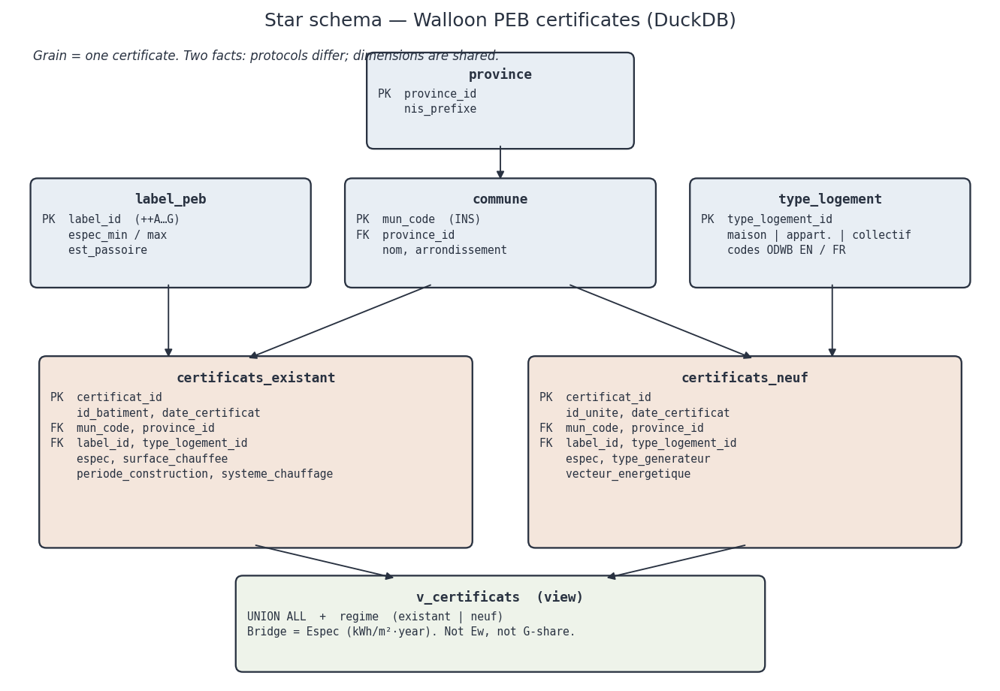
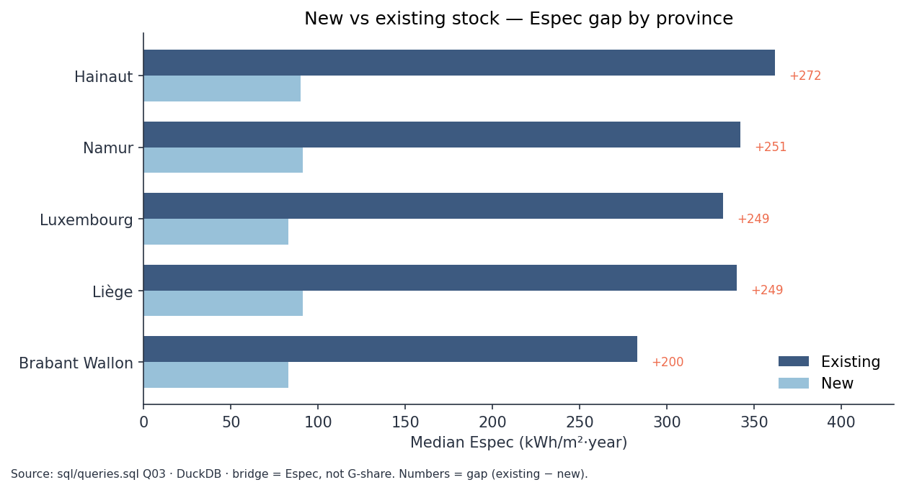

# Walloon PEB — technical write-up

*Synthesis — Espec as the bridge, Ew missing*

---

## Problem framing

ODWB extracts are flat. We need a star schema: shared geographic
dimensions (`mun_code`), two facts (existing vs new), aggregates without
GIS.

---

## Profiled data

- Existing: 874,605 certificates (unique IDs in the Parquet).
- New: 110,855 certificates (unique IDs).
- 261 municipalities, 5 provinces, on both sides.
- Espec + letter label **on both sides**; **no Ew column**.

---

## Measurement bridge

Empirical label thresholds (++A…G) match the Walloon Espec scale
(e.g. B = 85–170 kWh/m²·year). We compare **Espec**, not the share
of G (0 % in new stock, 21 % in existing).

Limit: existing-stock certificates ≠ new-build protocol.

---

## Star schema

Two facts, shared dimensions. View `v_certificats` = UNION ALL
with `regime` in the legend. Grain = certificate.

---

## Queries (11)

`sql/queries.sql`: RANK, LAG, QUALIFY, CTEs. Espec gap new vs existing:
**272** kWh/m²·year in Hainaut, **200** in Walloon Brabant.
Passoire *rate* ≠ floor-area *volume* (Hastière vs Charleroi).
Priority view = 60 % volume + 40 % rate. Spatial: SPW limits, density
and `ST_Touches` — no map.

---

## Recommendations

**Public.** Volume → Charleroi / Liège; rate → rural communes;
regional priority = Hainaut. Do not use G-share as a new-vs-existing KPI.

**Private.** Houses + stoves / direct electric. Existing heat pumps
(median 145) already close to new builds (88).

Limits: certificates ≠ full stock; 47 % missing period; distinct protocols.

---

## Tech stack

ETL + charts (`scripts/etl_odwb.py`, `scripts/synthese_figures.py`).

Analytical engine, no server.

Business analysis in `sql/queries.sql`. matplotlib only illustrates SQL.

---

## Code

`sql/schema.sql`, `sql/load.sql`, `sql/queries.sql`, `sql/spatial.sql`,
`notebooks/synthese_resultats.ipynb`, `docs/exploration.md`,
`scripts/download_odwb.py`, `scripts/etl_odwb.py`,
`scripts/run_queries.py`, `scripts/synthese_figures.py`,
`scripts/load_spatial.py`, `scripts/run_spatial.py`.
